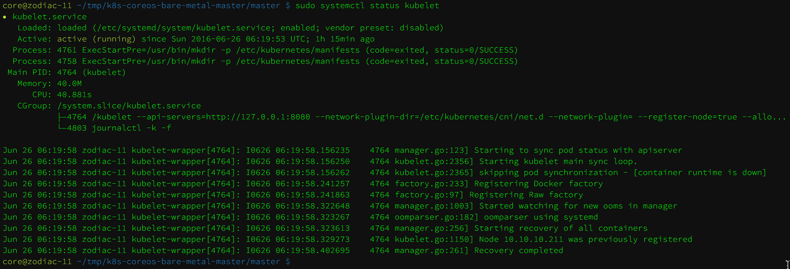
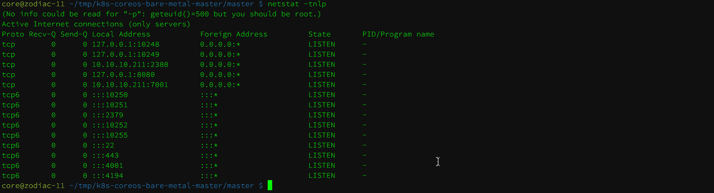
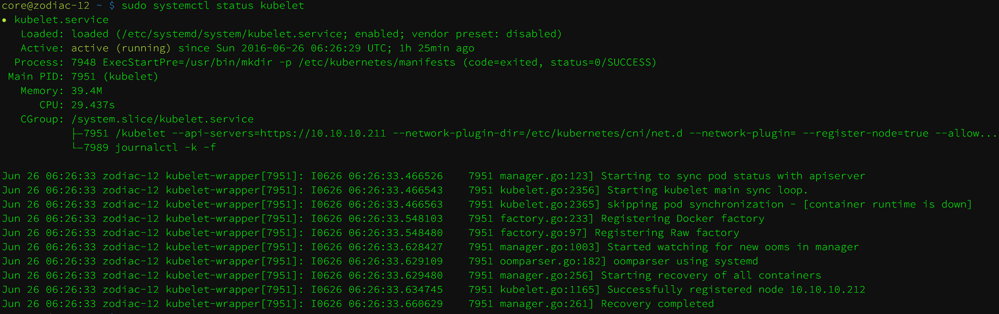
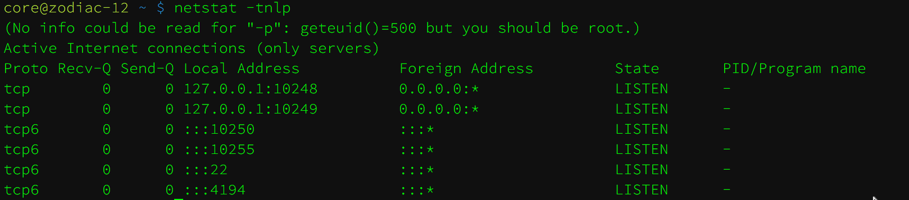
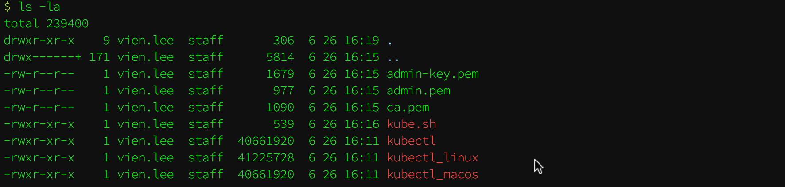
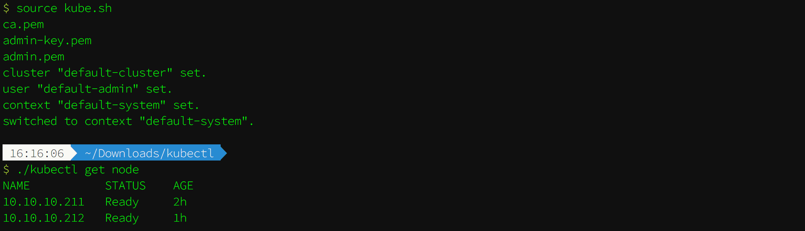

# k8s-coreos-bare-metal

## 1. 功能说明

　　在 CoreOS 初始化完毕后, 可以通过官方文档 [CoreOS + Kubernetes Step By Step](https://coreos.com/kubernetes/docs/latest/getting-started.html) 完成安装 kubernetes 相关组件, 但是过程比较烦杂, 容易出现错误. 本项目的目标在 master 和 worker 上执行相应的脚本, 能快速完成 kubernetes 集群的配置.

项目修改自 [xiaohe1977/coreos-bare-metal:bare-metal](https://github.com/xiaohe1977/k8s-coreos-bare-metal), 修改内容如下:

- 重构说明文档
- 脚本修改 master 和 worker 节点 TLS 生成逻辑
- 脚本增加 worker 节点配置 flanneld.service 服务
- 脚本增加 flanneld 配置后服务重启生效

## 2. 使用说明

### 2.1. 术语约定

- k8s => kubernetes

### 2.2. 前提环境

在使用脚本安装前, 需要确定集群服务器能稳定翻墙和 CoreOS 中的 `etcd2` 正常运行, 脚本会进行以下操作:

- 生成 master 和 worker 的 TLS 秘钥
- 配置 flanneld
- 配置 kubelet
- 生成 k8s 服务组件配置文件
  - master (kube-apiserver.yaml、kube-controller-manager.yaml、kube-proxy.yaml、kube-scheduler.yaml),
  - worker (kube-proxy.yaml)
- 通过 kubelet 服务启动 k8s 服务组件容器

### 2.3. 环境配置

__etcd2__

 etcd2 多节点组成的高可用配置管理服务, 通过配置 `ETCD_DISCOVERY` 让节点之间自动发现组成集群. `ETCD_DISCOVERY` 配置项通过下面命令生成:

```bash
# 其中 size=3 是集群中节点的数量
curl -w "\n" 'https://discovery.etcd.io/new?size=3'
```

通过 cloud-config 配置 etcd2, 多节点需要修改相应字段, 配置文件如下:

- 10.10.10.191 地址需要替换成本机的 IP 地址
- hostname 字段更换为本机的名称

```yaml
#cloud-config

coreos:
    etcd2:
        discovery: "https://discovery.etcd.io/4ec397f88b10332c5db76aa55a36767d"
        # multi-region and multi-cloud deployments need to use $public_ipv4
        advertise-client-urls: "http://10.10.10.191:2379"
        initial-advertise-peer-urls: "http://10.10.10.191:2380"
        # listen on both the official ports and the legacy ports
        # legacy ports can be omitted if your application doesn't depend on them
        listen-client-urls: "http://0.0.0.0:2379,http://0.0.0.0:4001"
        listen-peer-urls: "http://10.10.10.191:2380,http://10.10.10.191:7001"
    update:
        reboot-strategy: "etcd-lock"
    units:
        - name: "etcd2.service"
          command: "start"
        - name: "docker.socket"
          command: "start"

hostname: "coreos-191"

ssh_authorized_keys:
    - "ssh-rsa AAAAB3NzaC1yc2EAAAABIwAAAQEAzAy8KEKxDMmjd55RMKLFs8bhNGHgC+pvjbC7BOp4gibozfZAr84nWsfZPs44h1jMq0pX2qzGOpzGEN9RH/ALFCe/OixWkh+INnVTIr8scZr6M+3NzN+chBVGvmIAebUfhXrrP7pUXwK06T2MyT7HaDumfUiHF+n3vNIQTpsxnJA7lmx2IJvz6EujK9le75vJM19MsbUZDk61wuiqhbUZMwQEAKrWsvt9CPhqyHD2Ueul0cG/0fHqOXS/fw7Ikg29rUwdzRuYnvw6izuvBoaHF6nNxR+qSiVi3uyJdNox0/nd87OVvd0fE5xEz+xZ8aFwGyAZabo/KWgcMxk6WN0O1Q== lipeng@Megatron"
    - "ssh-rsa AAAAB3NzaC1yc2EAAAADAQABAAAAgQDXZ722k3K5gvfT6kirCHtZRmpEvnVnET3I3MY6V5zqStkPi+yGWM4er6gkst98FGBsF5N/CfTnwUk7SAJbsugMPk0F0HGbrDDTtqzLAJKrN+chPbpwQUZip1/vstGCO24bxCWj9DgaN4tn4k0piskZu5wmwK+1BWyL1oycijbdtQ== renhe@renhe-ThinkPad-X240"
    - "ssh-rsa AAAAB3NzaC1yc2EAAAADAQABAAABAQDVwfLAgA8DICHp0//xfBTgfU34fVOtKpxgrkceC605HGQ6GIPsBHKw6CYeGziwZBDNtMZxTeyQ7+79sqA2VUR2I5nrhlxw/Wc80yTsjbRmcIbr3mUNCd3+cOqnOAsWEucZCHHcNYwUQ3wIOoyP0cBLKI4b25ucgtawxCmB7PJ1Cme+vIf1cVffeQqedu7hmlpQf/DnQc7O1iBRhEAqKgy1Y+hb0Ryc7StAe0nDHCj+2b08vHlNXaS2sJKrXUE0HhCZZP46APaLmZPmmHeoJKx31M0IERWYaZRvLe0Pl7Pp6DueOSJvvNwR5YbNe5aQ2pO3xiv3wCj6n66dlqAhpmmD vien.lee@localhost"
    - "ssh-rsa AAAAB3NzaC1yc2EAAAADAQABAAABAQCrYpsQVHBRUA/sZfxgK+9jZBGZfoulXXe0faPCGC0b3L6z/qYzJnNFf1d4gj6hQaGyHGvVlr6Kd/6y+0Eour51R2H+8FO+9Y7BaomuluHzm/jcgruAmbVrXZ8vKDDPDx4Lf1tnU1SqPpKFRgdro+BUcj/0LZ45tzsblpA2JOiMJkpqtx17WPKIzc9q5OZKVcV+zh/O+JuKLW/bDIndGiQRVJBGa87ZkCf+fzO5ME4nl7MsG/YY+9J/UkwDbZQd3wFTRqmHncrSupNhu1R2DttP9eWSHQsJIaEXmqKv4p7p4byztix3A/2hBUILZa3iDwxlCZq7OBrQCc/xOI45VMR7 liangjiameng@liangjiameng-Ubuntu"

users:
  - name: "ops"
    passwd: "$6$rounds=656000$fgFH.d8/o8iamB2U$maTs.wA6WnRe0Lg4vBd9E6PVI9lsENftY5i4bmBCTSiu14WYNsRMg5dgKWJAdvKESC1Y1YvN4F3vYVqugc8Np/"
    groups:
      - "sudo"
      - "docker"
```

__cloud-config 使用说明__

cloud-config 有三种使用方式:

- coreos-install: 系统安装时指定 cloud-config 配置文件, 会拷贝为 /var/lib/coreos-install/user-data, 每次启动时都会初始化
- coreos-cloudinit: 使用 `sudo coreos-cloudinit --from-file config.yml` 会立即配置 cloud-config , 重启后以`/var/lib/coreos-install/user-data` 配置为主
- 修改 /var/lib/coreos-install/user-data 后每次重启系统都会重新配置

### 2.4 执行脚本

通过以上方法使得集群 `etcd2` 运行正常, 下面就开始执行 k8s 集群的安装脚本

__Master 节点安装__

进入家目录, 下载 k8s-coreos-bare-metal 项目 zip 包 进入 master 安装目录

```shell
# 下载项目 ZIP 包, 并解压
cd ~ && wget https://github.com/k8sp/k8s-coreos-bare-metal/archive/master.zip && unzip master.zip

# 进入 master 安装目录
cd k8s-coreos-bare-metal-master/master/
```

修改 environment 中 `COREOS_PUBLIC_IPV4`、`COREOS_PRIVATE_IPV4` 中 IP 地址为本机 IP

```shell
# 修改 environment
vim environment
------
COREOS_PUBLIC_IPV4=10.10.10.191
COREOS_PRIVATE_IPV4=10.10.10.191
```

执行 k8s master 安装脚本

```shell
sudo bash setup_k8s_master.sh
```

执行完后, 确认 Kuberlet 服务正常, 443、8080等端口正常打开, 如下图:  



__Worker 节点安装__

下载 k8s-coreos-bare-metal 项目 zip 包 进入 worker 安装目录

```shell
# 下载项目 ZIP 包, 并解压
wget https://github.com/k8sp/k8s-coreos-bare-metal/archive/master.zip && unzip master.zip

# 进入 worker 安装目录
cd k8s-coreos-bare-metal-master/worker/
```

修改 environment 中 `COREOS_PUBLIC_IPV4`、`COREOS_PRIVATE_IPV4`、`KUBERNETES_MASTER_IPV4`、`KUBERNETES_WORKER_FQDN` 中 变量信息

- COREOS_PUBLIC_IPV4、COREOS_PRIVATE_IPV4: 本机 IP 地址
- KUBERNETES_MASTER_IPV4: master 节点 IP地址
- KUBERNETES_WORKER_FQDN: worker 节点命名

```shell
# 修改 environment
vim environment
------
COREOS_PUBLIC_IPV4=10.10.10.212
COREOS_PRIVATE_IPV4=10.10.10.212
KUBERNETES_MASTER_IPV4=10.10.10.211
KUBERNETES_WORKER_FQDN=kube-worker1
```

创建 ssl 目录, 拷贝 master 节点 /home/coreos/k8s-coreos-bare-metal-master/master/ssl/worker 到 ssl 目录下

```shell
# 创建 ssl 目录
mkdir ssl
# 拷贝项目目录下 ssl/worker 到 ssl/
scp -r kube-master:~/k8s-coreos-bare-metal-master/master/ssl/worker ssl/
```

执行 k8s worker 安装脚本

```shell
sudo bash setup_k8s_worker.sh
```

执行完成后, 等待 3 分钟确认 kubelet 服务、端口状态





__配置客户端 Kubectl__

下载 k8s-coreos-bare-metal 项目 zip 包 进入 kubectl 安装目录

```shell
# 下载项目 ZIP 包, 并解压
wget https://github.com/k8sp/k8s-coreos-bare-metal/archive/master.zip && unzip master.zip

# 进入 kubectl 安装目录
cd k8s-coreos-bare-metal-master/kubectl/
```

根据不同的系统配置不同kubectl

```shell
# Linux 客户端
ln -sf kubectl_linux kubectl

# MacOS 客户端
ln -sf kubectl_macos kubectl
```

拷贝 master 节点项目生成的连接秘钥文件( /home/coreos/k8s-coreos-bare-metal-master/master/ssl/kubectl/*)到到当前目录,

```shell
scp -r kube-master:~/k8s-coreos-bare-metal-master/master/ssl/kubectl/* .
```

当前目录下的文件如下图:



修改 kube.sh 中 `MASTER_HOST` 的IP地址

```shell
vim kube.sh
------
#! /bin/bash

MASTER_HOST=10.10.10.211
```

执行 kube.sh, 测试 kubectl 命令是否正常

```shell
# 导入配置到当前 bash 环境
source kube.sh

# 测试 kubectl 连接是否正常
./kubectl get node
```

